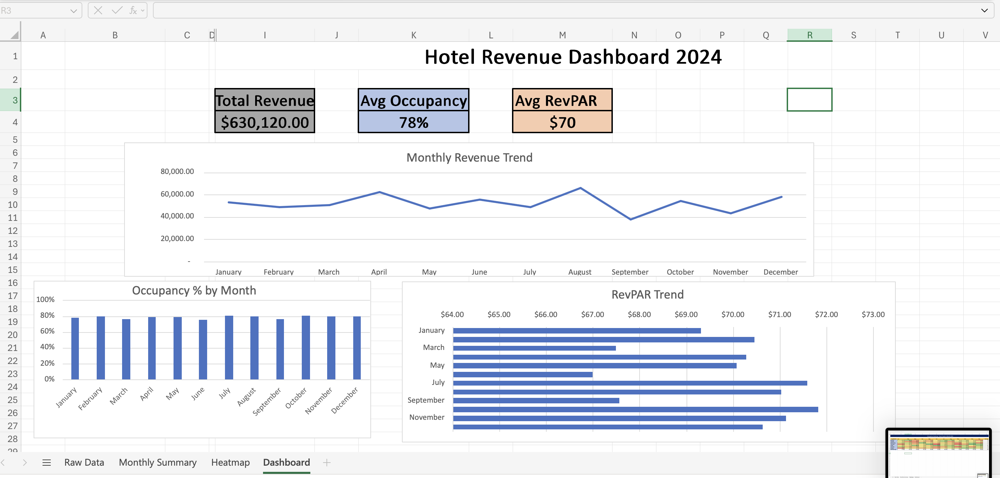
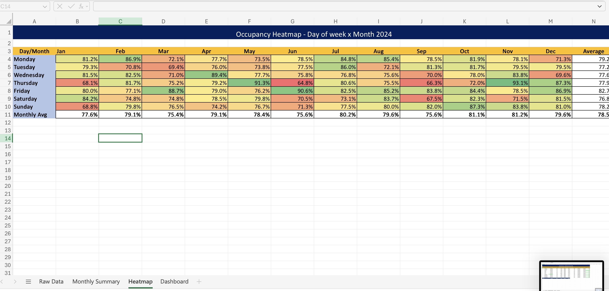
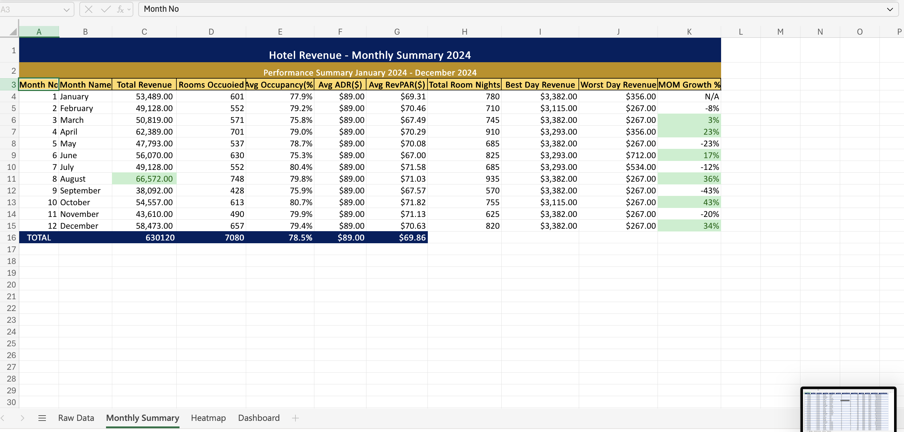
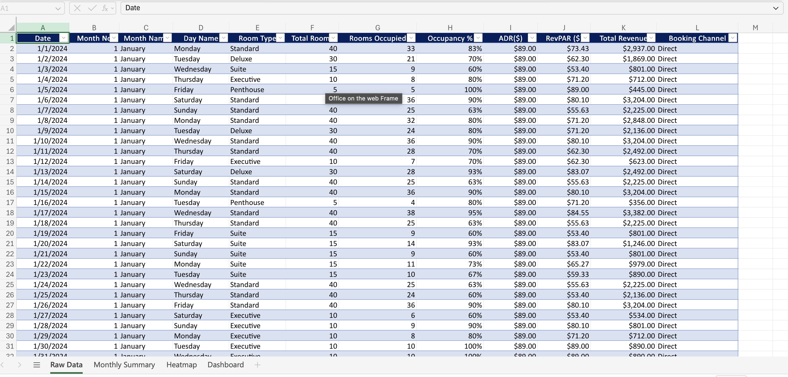

# 🏨 Hotel Revenue Analytics Dashboard 2024  

An interactive analytics dashboard built using **Microsoft Excel** to analyze hotel performance across revenue, occupancy, and pricing metrics.

This project highlights how **operational data like occupancy, ADR, and RevPAR** influence overall hotel revenue and helps identify performance trends across the year.

---

## 📌 Project Overview  

Hotel performance depends on multiple factors such as demand, pricing strategy, and occupancy levels. One key question this project explores is:

👉 How can hotel data be used to improve revenue and operational efficiency?

This dashboard analyzes:
- Monthly revenue performance 📈  
- Occupancy trends across the year 🏨  
- RevPAR (Revenue per Available Room) patterns 💰  
- Daily and seasonal demand using heatmaps 🔥  

The objective is to provide a clear and structured view of hotel performance for better decision-making.

---

## 🚀 Key Features  

✔️ Monthly revenue trend analysis  
✔️ Occupancy % tracking across months  
✔️ RevPAR performance insights  
✔️ KPI indicators for quick overview  
✔️ Day-wise occupancy heatmap  
✔️ Clean and structured Excel dashboard  

---

## 🛠️ Tools Used  

- 📊 Microsoft Excel  
- 📈 Data Visualization  
- 📉 Business Data Analysis  

---

## 📂 Dataset Information  

The dataset used in this project is a structured Excel file containing daily hotel performance data for the year 2024.

### Features included:
- Date & Month  
- Room Type  
- Total Rooms & Rooms Occupied  
- Occupancy %  
- ADR (Average Daily Rate)  
- RevPAR  
- Total Revenue  
- Booking Channel  

### Data Preparation:
- Cleaned and structured raw data  
- Created monthly summary metrics  
- Calculated KPIs (Revenue, Occupancy, RevPAR)  
- Applied conditional formatting for heatmap visualization  

## DataSet

---

## 📊 Dashboard Preview  

### 🏨 Main Dashboard  
  

### 🔥 Occupancy Heatmap  
  

### 📊 Monthly Summary Table  
  

### 📄 Raw Dataset  
  

---

## 🌐 Live Dashboard  

👉 https://onedrive.live.com/:x:/g/personal/B206A59701A10497/IQCes4ng8tOeRJ1zUfqSyIakAdiqjuGk0rsPMyrlN5cwNfE?rtime=O2uY0cqe3kg&redeem=aHR0cHM6Ly8xZHJ2Lm1zL3gvYy9CMjA2QTU5NzAxQTEwNDk3L0lRQ2VzNG5nOHRPZVJKMXpVZnFTeUlha0FkaXFqdUdrMHJzUE15cmxONWN3TmZFP2U9VUtSQjRO  

---

## 🎯 Key Insights  

- 📈 Revenue shows seasonal variation with noticeable peak periods  
- 🏨 Occupancy remains consistently around 75–80%  
- 💰 Higher RevPAR aligns with stronger revenue months  
- 📉 Certain months indicate lower demand, highlighting improvement areas  
- 🔥 Weekend occupancy is generally higher than weekdays  

---

## 💡 Conclusion  

This dashboard demonstrates how operational hotel data can be transformed into actionable insights. By analyzing revenue, occupancy, and pricing together, businesses can make informed decisions to improve performance and maximize profitability.

---

## 👩‍💻 Author  

Karishma S  
Data Analytics Enthusiast  

---

## ⭐ If you like this project  

Give it a ⭐ on GitHub and share your feedback!

---

## 📬 Contact  

LinkedIn: https://www.linkedin.com/in/karishma-s-a080ab315/  

Feel free to connect for collaboration or opportunities 🚀
